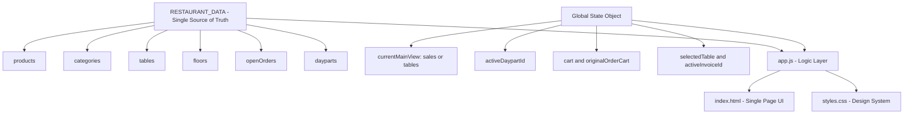
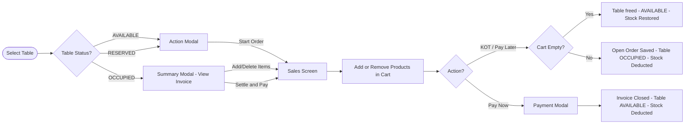
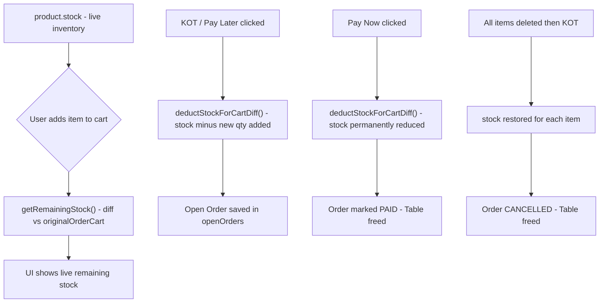
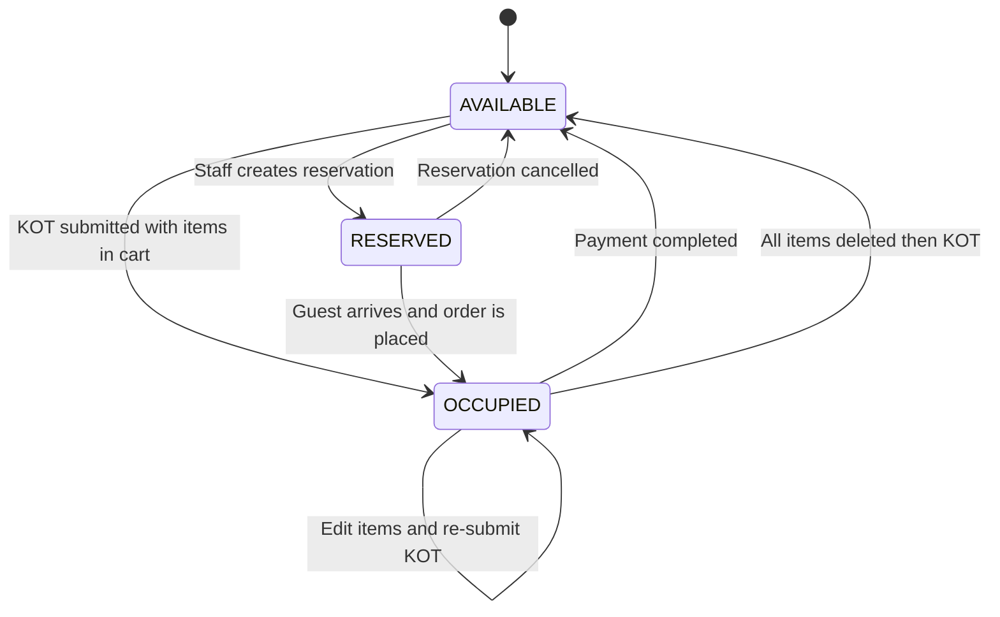
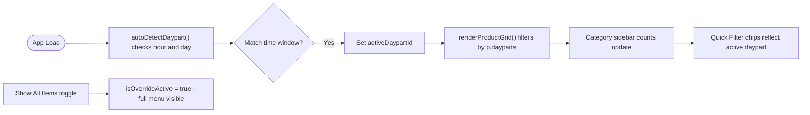

# Managerium POS
**A full-featured Restaurant Point-of-Sale system** built with pure HTML, CSS and JavaScript. No frameworks, no build tools.

Live: https://istimam.github.io/POS/

---

## Features

| Module | Capabilities |
|---|---|
| Sales Screen | Product grid, cart, discounts, VAT, order types |
| Daypart Filtering | Auto-detects time of day, filters menu accordingly |
| Quick Filters | Configurable chip bar for fast menu switching |
| Floor Layout | Drag-and-drop tables across multiple floors |
| Table Management | AVAILABLE / RESERVED / OCCUPIED states + reservations |
| Stock Control | Real-time inventory deduction and restoration on cancel |
| Payment Flow | Pay Now (cash/card/mobile) or Pay Later (KOT) |
| Back Office | Category sequencing, item enable/disable, daypart config |

---

## System Architecture

---

## Order Lifecycle

---

## Stock Management Flow

---

## Table State Machine

---

## Daypart Auto-Filter System

---

## File Structure

`
Supplier7Star/
├── index.html      # Single-page UI - all modals, views, layout
├── app.js          # All logic - data, state, rendering (~2300 lines)
└── styles.css      # Design system - CSS variables, components
`

### app.js Module Breakdown

| Section | Key Functions |
|---|---|
| Data Schema | RESTAURANT_DATA - products, tables, floors, orders, dayparts |
| Global State | state object - single reactive store for all UI state |
| Initialization | DOMContentLoaded, startClock, autoDetectDaypart |
| Sales Screen | renderPOS, renderProductGrid, renderCategories, renderCart |
| Stock Logic | getRemainingStock, deductStockForCartDiff |
| Cart Operations | addToCart, updateCartQty, clearCart, applyDiscount |
| Order Processing | processPayLater, processPayment, cancelOrder |
| Floor Layout | renderFloorCanvas, enableTableDragging, selectTableForOrder |
| Table Modals | openTableSummaryModal, openTableActionModal, openReservationModal |
| Back Office | renderBoCategorySeqTable, renderBoItemEditor, renderBoDaypartsTable |
| Payment | openPaymentModal, selectPayMethod, addTender, calcChange |

---

## Key Design Decisions

- **Single source of truth** - RESTAURANT_DATA is the database; state is the UI layer
- **No backend** - all data lives in-memory in the browser, ideal for demo/prototype
- **Stock diff model** - stock deducted only on KOT/Pay; originalOrderCart prevents double-deductions when editing open invoices
- **Daypart-driven menu** - menu is time-aware by default; staff can override to show everything
- **Vanilla JS** - zero build tools, zero npm; open index.html and it runs

---

## Running Locally

`ash
python -m http.server 8080
`

Then visit http://localhost:8080

---

*Built for Dhanmondi Outlet - Supplier7Star / AkijiBos Group*